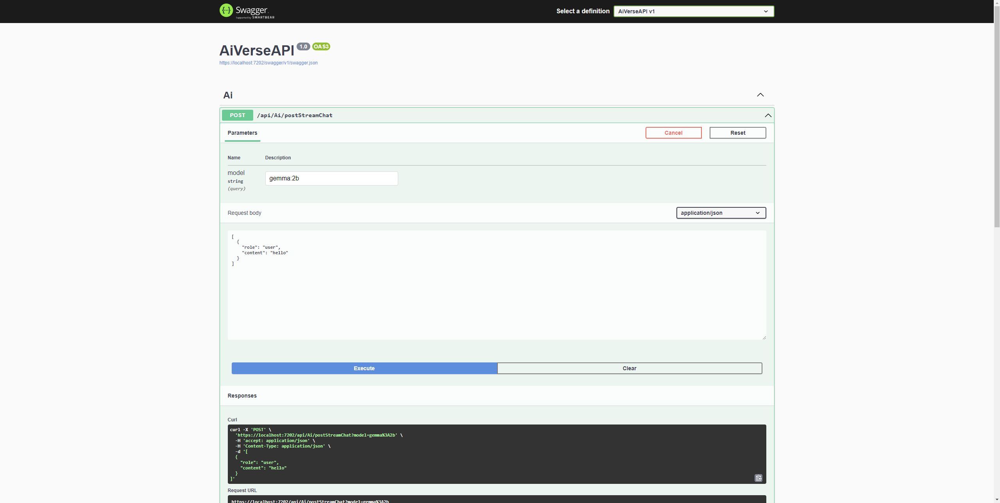

# AI Verse API

The API for [AI Verse](https://github.com/robertmok/ai-verse)

## Setup

### Prerequisites

- Install [Ollama](https://ollama.com/)
- Download [gemma:2b](https://ollama.com/library/gemma)
- Download [orca-mini:3b](https://ollama.com/library/orca-mini)

### Quickstart

- Have **Ollama** running
	- Ollama REST API runs on http://localhost:11434
- Run the project on **https**
	- Swagger will be running on https://localhost:7202/swagger/index.html
	- SignalR hub will be running on https://localhost:7202/hub
- Follow the **Setup** section in [AI Verse](https://github.com/robertmok/ai-verse)

## Future

- add support to use any LLMs
- Dockerfile

